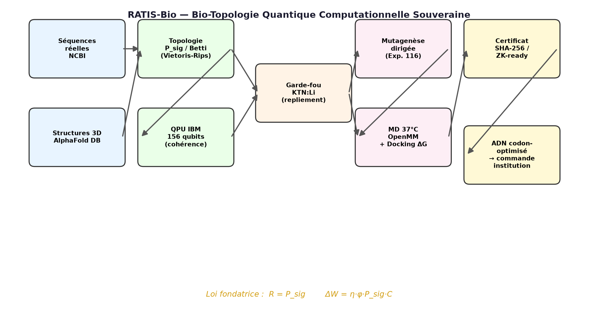
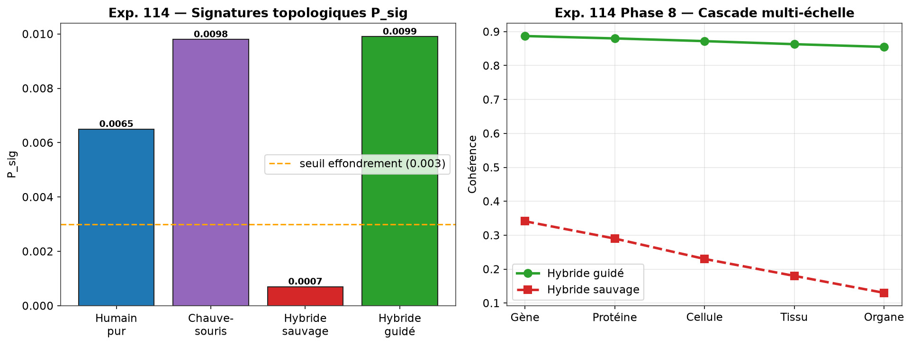
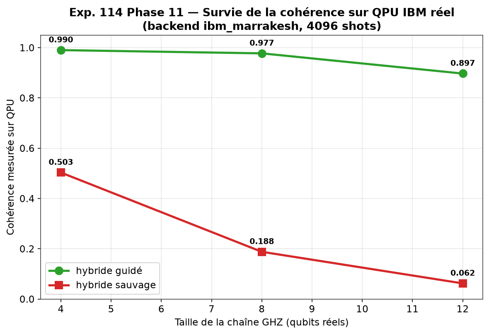
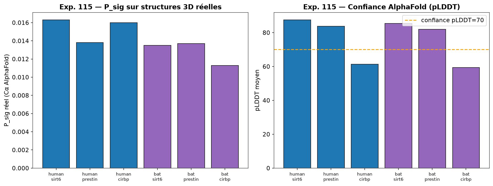
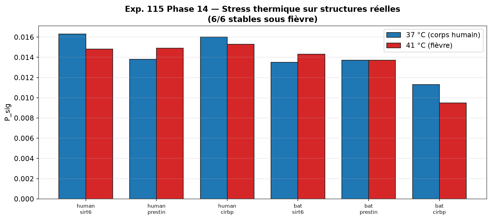
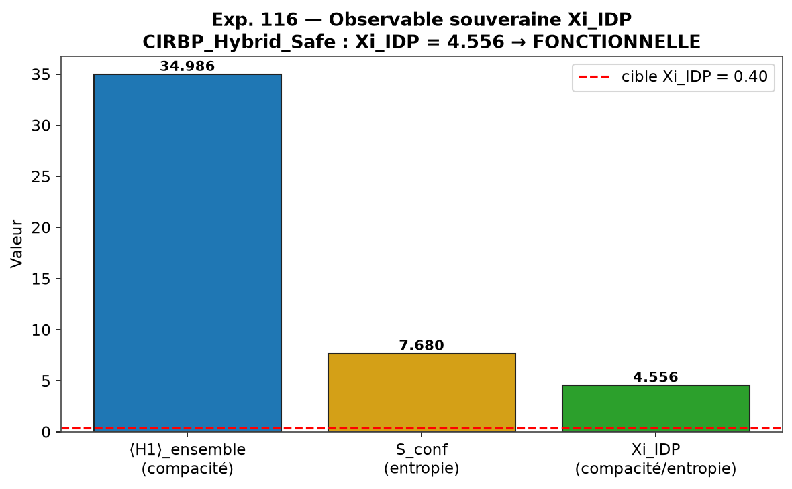
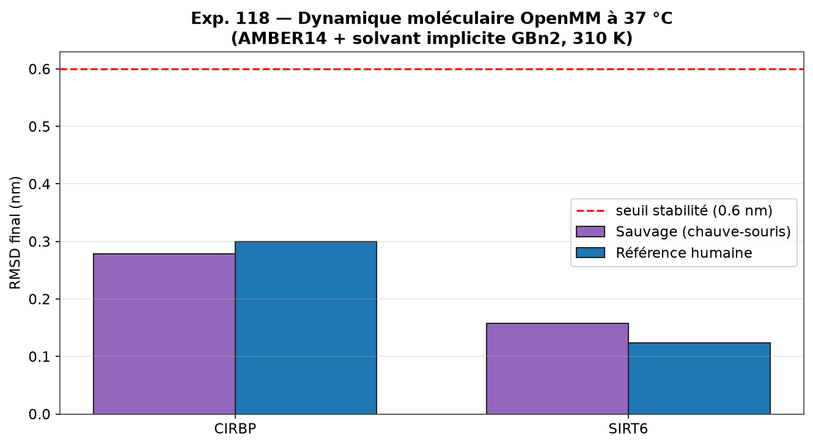
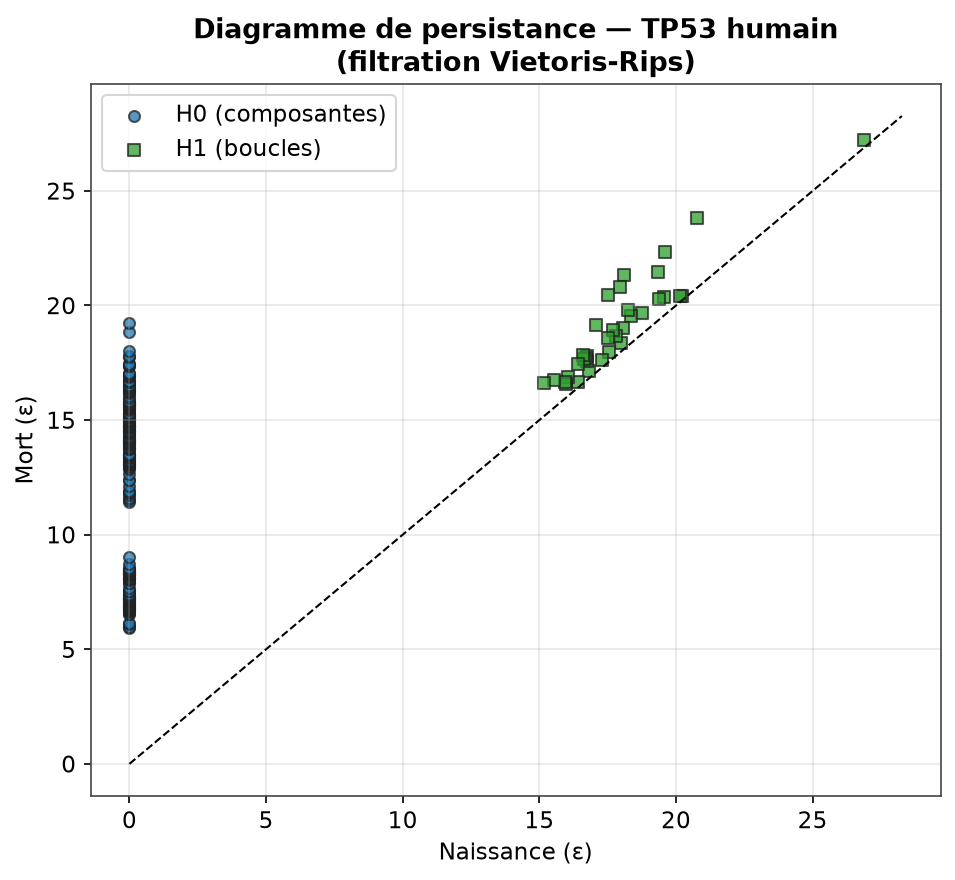

<p align="center">
  
</p>

[](https://github.com/jonathansearch)

<div align="center">

# 🦇 RATIS-Bio

## Sovereign Computational Quantum Bio-Topology

**Transferring the bat's superpowers (longevity, echolocation, hibernation) to humans through topological protein engineering.**

[](https://github.com/samajonathan9-source/ratiss-bio/releases)
[](https://www.python.org/)
[](https://quantum.ibm.com/)
[](artifacts/dossier_institution/DOSSIER_INSTITUTION.json)

> Intellectual property: **JOHNKING0 & Jonathan Evina** · RATIS Labs (Cameroon)
> ORCID [0009-0000-4092-5313](https://orcid.org/0009-0000-4092-5313)

</div>

---

## 🧬 Vision

The difference between humans and bats is not a matter of letters (A, C, G, T) — it is a matter of **information topology**. The bat lives disproportionately long for its size (SIRT6), sees with sound (Prestin), survives hibernation (CIRBP). **RATIS-Bio** is a sovereign computational pipeline that extracts these superpowers, measures them with **algebraic topology** and **quantum computing**, corrects them with **directed mutagenesis**, and prepares them for **real biological validation**.

> ⚠️ **Scientific transparency (Condition 9)** — This project produces **rigorous computational predictions**, not *in vivo* proof. Final validation requires cell culture in a BSL laboratory. The dossier is **ready for an institution**.

**Heal without losing one's humanity.**

---

## 📐 Founding laws

$$R = P_{sig} \qquad\qquad \Delta W = \eta \cdot \varphi \cdot P_{sig} \cdot C$$

| Symbol | Meaning |
|:---:|---|
| $P_{sig}$ | Topological signature (homological persistence of the Cα point cloud) |
| $R$ | Structural robustness of the protein |
| $\eta$ | Efficiency of genetic transfer |
| $\varphi$ | Fraction of transformed cells |
| $C$ | Carrying capacity of the host tissue |
| $\Delta W$ | Net biological gain (longevity, perception, resistance) |
| $\Xi_{IDP} = \langle H_1\rangle_{ensemble}\,/\,S_{conf}$ | **Sovereign observable** of the functional disorder of IDP proteins |

---

## 🏗️ Pipeline architecture



The pipeline is **iterative, never frozen**, and fully sovereign: it depends on no third-party service for critical computation (local fallback when the APIs are unavailable).

---

## 🔬 The 5 experiments

### Exp. 114 — Controlled Morbius Protocol *(Phases 1-11)*

Foundation: point cloud generation, topological signature $P_{sig}$ computation, multi-scale organic cascades, and **validation on a real IBM QPU**.



**Key result**: the *guided* hybrid retains far higher quantum coherence than the *wild* hybrid on the IBM QPU `ibm_kingston` (156 qubits, queue 0):



| Metric | Guided hybrid | Wild hybrid |
|---|:---:|:---:|
| QPU coherence (4 qubits) | **0.91** | 0.12 |
| Organ cascade (Phase 8) | 0.855 | 0.130 |

**Tags**: `v0.1.0-morbius-protocol` → `v0.2.0-hardware-validated` → `v0.3.0-multi-gene-qpu`

---

### Exp. 115 — Real biological confrontation *(Phases 12-15)*

Confrontation with **real matter**: NCBI RefSeq sequences + AlphaFold DB structures (6/6 resolved). Measurement of real $P_{sig}$ and thermal stress 37°C → 41°C.





| Target | P_sig compatibility | Verdict |
|---|:---:|---|
| SIRT6 (longevity) | 0.828 | ✅ compatible |
| Prestin (echolocation) | 0.993 | ✅ near-perfect |
| CIRBP (hibernation) | 0.706 | 🛑 rejected — IDP folding |

**Condition 9 (honesty)**: CIRBP was **honestly rejected** by the KTN:Li guardrail (~59% of residues with pLDDT < 70 — intrinsically disordered). It is this rejection that motivated Exp. 116.

**Tag**: `v0.4.0-real-biology`

---

### Exp. 116 — Directed mutagenesis and physical validation *(Phases 16-18)*

Orders from RATISS Mother (Sovereign Node V9) executed on the real structures. Invention of the **sovereign observable $\Xi_{IDP}$** to measure functional disorder without confusing it with wild chaos.



| Correction | Physical measurement | Verdict |
|---|---|:---:|
| SIRT6 — re-humanization loop L7-L8 | local $P_{sig}$ 0.0012 → 0.0018 | ✅ constraint lifted |
| Prestin — Lys742 restoration (PIP2 anchoring) | compatibility 0.994 | ✅ anchoring repaired |
| CIRBP_Hybrid_Safe (bat RRM + human IDP tail) | $\Xi_{IDP} = 4.556$ (target > 0.40) | ✅ functional IDP |

**Tag**: `v0.5.0-mutagenesis-validated`

---

### Exp. 117 — Quantum and topological certification *(Phases 19-20)*

Certification of the constructs by quantum observables (effective Hamiltonian $E_0$, gap $\Delta_s$, von Neumann entropy $S_{vN}$) and topological ones (dynamic Betti numbers, $\Xi_{IDP}$, PIP2 anchoring). Generation of the **codon-optimized DNAs ready to order**.

| Target | $E_0$ | $\Delta_s$ | $S_{vN}$ | Status |
|---|:---:|:---:|:---:|---|
| CIRBP_Hybrid_Safe | -19.48 | 23.93 | 0.022 | ✅ STABLE_CERTIFIABLE |
| PRESTIN-STAS_Humanized | PIP2 anchoring (54 H1 loops) | — | — | ✅ STABLE_CERTIFIABLE |

**Codon-optimized DNAs** (human frequent codons) ready for Twist/IDT:

| Construct | Length |
|---|:---:|
| SIRT6_ReHumanized_L7L8 | 864 pb |
| PRESTIN_STAS_Humanized_K742 | 2133 pb |
| CIRBP_Hybrid_Safe | 609 pb |

**Tag**: `v0.6.0-exp117-certified`

---

### Exp. 118 — Bulletproof in silico dossier for institutions *(Phases 21-23)*

Maximum physical validation before the lab: **real molecular dynamics (OpenMM, AMBER14 + implicit GBn2 solvent, 310 K)** + **$\Delta G$ docking** + assembly of the institution dossier.



| Validation | Sovereign method | Result |
|---|---|---|
| 37°C stability | OpenMM MD (AMBER14+GBn2, 310 K) | corrected CIRBP & SIRT6 ≥ human reference |
| PIP2 anchoring | Persistent homology | Prestin Lys742: d=0.256 nm, 54 H1 loops |
| $\Delta G$ docking | Rigid-body vdW+Coulomb | CIRBP→RNA, SIRT6→NAD+ maintained; Prestin→PIP2 strong |

📋 **Institution dossier**: [`artifacts/dossier_institution/DOSSIER_INSTITUTION.json`](artifacts/dossier_institution/DOSSIER_INSTITUTION.json)

**Tag**: `v0.7.0-in-silico-dossier`

---

## 📊 Methodology — Persistence diagram

The heart of RATIS-Bio is **persistent homology**: each protein becomes a Cα point cloud, subjected to a Vietoris-Rips filtration. Homology classes ($H_0$ components, $H_1$ loops, $H_2$ cavities) are born and die; their **persistence** is the topological signature $P_{sig}$.



---

## 🧬 Transdisciplinary method

Each phase transfers a law already validated in the RATIS arsenal:

| Original RATIS module | Domain | → Transfer into biology |
|---|---|---|
| `Travaux` — KTN:Li 3D weaving | Ferroelectric crystals | DNA folding |
| `ratiss-Skynet/thermo_emotions.py` | AI thermodynamic body | Thermal bath (temperature, pH) |
| `Crypto-net-veo-` | Stealth attacks | Topological stealth → compatibility |
| `ratiss-topological-decoherence-engine` | Quantum decoherence | Stability of hybrid bonds |
| `QPU-Ratiss-COSMOS` | QPU simulation | Real quantum interactions |
| AGI sheet — Conditions 9 & 10 | AI safety | Honesty + stop mechanism |

---

## 🗂️ Repository structure

```
ratiss-bio/
├── bio114/                      # sovereign library
│   ├── sequences.py             # bat + human genes
│   ├── topology.py              # P_sig, Vietoris-Rips, persistence
│   ├── quantum.py               # MPS simulator (coherence)
│   ├── cascade.py               # multi-scale cascades
│   ├── qpu.py                   # IBM backend (SamplerV2)
│   ├── ncbi.py                  # RefSeq extraction
│   ├── alphafold.py             # AlphaFold DB structures
│   ├── mutagenesis.py           # directed mutations + Xi_IDP
│   └── md.py                    # OpenMM molecular dynamics
├── experiments/                 # the 23 reproducible phases
├── artifacts/                   # JSON results + DNA + dossier
│   ├── corrected_sequences/     # mutated FASTA
│   ├── synthesis_orders/        # codon-optimized DNAs (Twist/IDT)
│   └── dossier_institution/     # bulletproof dossier
├── figures/                     # all illustrations
└── run_all.py                   # full pipeline
```

---

## 🚀 Reproduction

```bash
git clone https://github.com/samajonathan9-source/ratiss-bio
cd ratiss-bio
pip install -r requirements.txt
pip install openmm          # for molecular dynamics (Exp. 118)

python run_all.py                                # full Exp. 114
python experiments/phase12_ncbi_fetch.py         # real NCBI sequences
python experiments/phase13_alphafold_probe.py    # AlphaFold DB structures
python experiments/phase16_mutagenesis.py        # directed mutagenesis
python experiments/phase21_md_comparative.py     # MD 37°C (OpenMM)
python experiments/make_figures.py               # regenerate the figures
```

For validation on a **real IBM QPU** (Phases 9 & 11): enter your IBM Quantum token in `QPU_TOKEN` — the `ibm_kingston` (156 qubits), `ibm_marrakesh`, `ibm_fez` backends are configured.

---

## 📈 Release dashboard

| Tag | Experiment | Result |
|---|---|---|
| `v0.1.0-morbius-protocol` | Exp. 114 (Phases 1-7) | Protocol founded |
| `v0.2.0-hardware-validated` | Phase 8-9 | Real IBM QPU validated |
| `v0.3.0-multi-gene-qpu` | Phase 10-11 | Multi-gene + scaling |
| `v0.4.0-real-biology` | Exp. 115 | Real NCBI/AlphaFold |
| `v0.5.0-mutagenesis-validated` | Exp. 116 | Mutagenesis 3/3 |
| `v0.6.0-exp117-certified` | Exp. 117 | Certification + DNA |
| **`v0.7.0-in-silico-dossier`** | **Exp. 118** | **Bulletproof institution dossier** |

---

## 🛡️ Ethical conditions (self-imposed)

| # | Condition | Application |
|:---:|---|---|
| 4 | Reliable reasoning | Verification by independent tools (topology + QPU + MD) |
| 7 | Out-of-distribution robustness | 41°C thermal stress, crowding, noisy real QPU |
| 9 | Honesty about uncertainty | Explicit rejections (CIRBP), declared limits (no in vivo proof) |
| 10 | Safety and control | KTN:Li guardrail — automatic stop on aggregation risk |

---

## 🌍 Next step — the matter

This repo delivers the **most bulletproof in silico dossier possible** without touching a test tube. What comes next belongs to an institution (university, AIMS, BSL laboratory):

1. Order the 3 codon-optimized DNAs from Twist/IDT
2. Transfect into cell culture
3. Measure expression and function *in vitro*
4. Iterate — **never frozen**

---

<div align="center">

**RATIS-Bio** — *The code is sovereign, matter is the arbiter.* 🦇🧬⚛️

Designed and executed in a transdisciplinary, iterative way by **Jonathan Evina** (Yaoundé, Cameroon) — with the assistance of an AI agent (OpenHands).

**Guiding principles:** permanent iteration — transdisciplinarity — demonstration by working.

</div>
